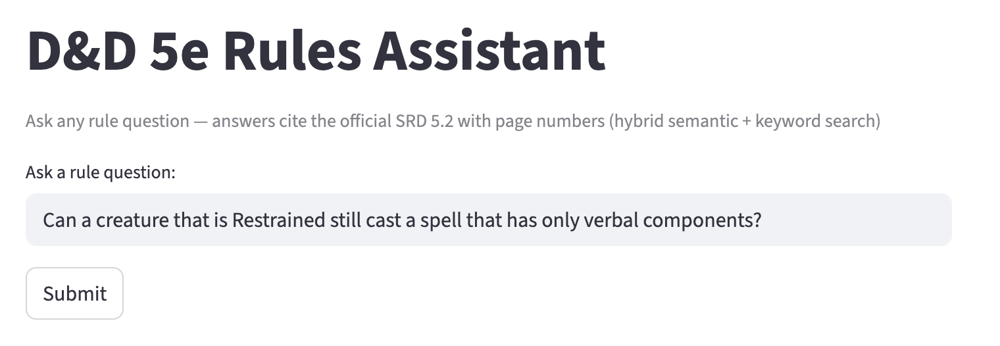
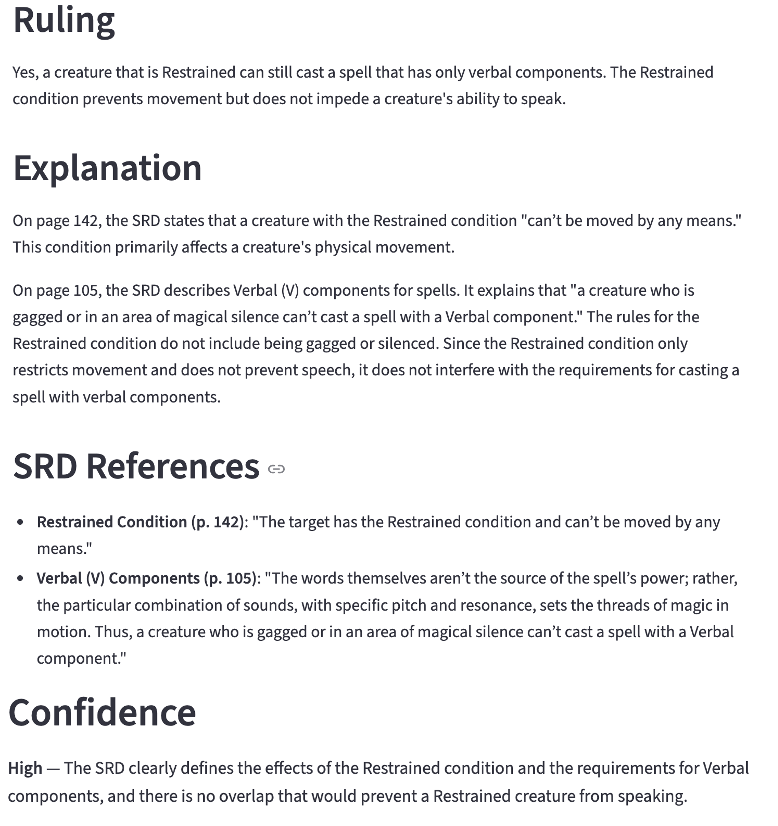

# D&D 5e Rules Assistant (RAG System)

A retrieval-augmented generation system that answers Dungeons & Dragons 5th Edition rules questions using the official SRD 5.2 document, with page-number citations to prove answers aren't hallucinated.

**Live App:** https://dungeons-dragons-assistant.streamlit.app/

---

## 1. Context, User, and Problem

**User:** D&D players and Dungeon Masters who need quick, accurate rulings during gameplay.

**Problem:** D&D 5e rules are spread across a 361-page document. Players frequently debate rule interpretations mid-game, slowing down play. Existing solutions (Google, forums, ChatGPT) either lack citations, hallucinate rules, or return outdated editions.

**Baseline (Status Quo):**
- **Manual lookup:** Searching the rulebook mid-game takes several minutes per question, breaking the flow of play.
- **Asking ChatGPT:** Mixes rules from different editions and online forums — no page citations, hard to verify or trust.

**Goal:** Build a RAG system that retrieves relevant SRD sections and generates rulings with exact page-number citations, allowing users to verify every answer against the source document.

---

## 2. Solution and Design

### Architecture

User Query → Hybrid Retrieval (Semantic + BM25) → Context Assembly → LLM Generation → Structured Answer

### Key Components

**PDF Extraction Pipeline (Colab)**
- Two-column extraction using PyMuPDF with explicit left/right fitz.Rect clipping
- Per-sentence page tagging before chunking (ensures 100% valid page numbers)
- 654 chunks, average ~370 words each
- Dedicated condition definition chunks injected to fix glossary coverage gaps

**Hybrid Search**
- 50% semantic similarity (all-MiniLM-L6-v2, 384-dim embeddings, cosine similarity)
- 50% BM25 keyword scoring (rank_bm25)
- Score threshold filtering (≥0.10) to reduce context dilution
- Fallback: always returns top 3 chunks even if below threshold

**Context Assembly**
- Lost-in-the-middle reordering: highest-scored chunks placed at beginning and end of context, lower-scored in middle, matching LLM attention patterns

**Prompt Engineering**
- Structured prompt architecture: Role → Task → Constraints → Output Format
- Explicit chain-of-thought instruction: "identify which rules apply and check whether ALL conditions are met"
- Multi-mechanic decomposition: "analyze each mechanic separately before combining"
- Few-shot example demonstrating ideal output format
- Structured output with confidence level and missing info
- Temperature=0 for deterministic outputs

**LLM:** Google Gemini 2.5 Flash via google.genai SDK

### Course Concepts Applied

| Concept | Implementation |
|---------|----------------|
| Context dilution | Score threshold filtering (≥0.10) to remove irrelevant chunks |
| Lost in the middle | Attention-aware chunk reordering |
| Few-shot examples | In-prompt example Q&A for output format |
| Chain-of-thought | Explicit multi-step reasoning instruction |
| Structured output | Confidence level + missing info fields |
| Prompt architecture | Role/Task/Constraints/Output format |
| Reasoning ≠ fix for bad context | Extraction-first approach validated |

---

## 3. Evaluation and Results

### Methodology

15 test cases across three categories:
- **Normal (8):** Single-rule lookups (Prone, falling damage, opportunity attacks, etc.)
- **Edge (4):** Multi-rule synthesis (Divine Smite + critical hit + fiend, Invisible + Prone, Action Surge + spellcasting)
- **Adversarial (3):** Fabricated rules, misleading premises

Scoring criteria:
- **Correct:** Factually accurate answer with valid page-number citations
- **Partial:** Mostly right but missing a condition, incomplete reasoning, or citation issue
- **Failed:** Wrong answer or completely missing the relevant rule

### Results Summary

| Iteration | Configuration | Correct | Partial | Failed |
|-----------|---------------|---------|---------|--------|
| 7 | Hybrid search, top_k=10 (first full eval) | 7/15 | 4/15 | 4/15 |
| 10 | + CoT, few-shot, threshold 0.15, reorder | 11/15 | 2/15 | 2/15 |
| 11 | + Score threshold 0.15 → 0.10 | 12/15 | 2/15 | 1/15 |
| 12 | + Inject 12 missing condition chunks (final) | **12/15** | **3/15** | **0/15** |

Compared to the status quo baseline: the system answers in seconds with page citations from the official SRD only, whereas manual lookup takes minutes and ChatGPT provides unverifiable answers that mix editions.

### Key Findings

1. **Extraction quality is the foundation.** Switching from pdfplumber to PyMuPDF with column clipping fixed text interleaving. Adding per-sentence page tags achieved 100% valid page numbers. Adding dedicated condition chunks fixed retrieval failures. This validates the principle that reasoning does not fix bad context.

2. **Hybrid search > pure semantic.** BM25 catches exact keyword matches that semantic search misses (e.g., "Incapacitated" as a specific game term), while semantic search handles paraphrased queries.

3. **Every fix creates tradeoffs.** Increasing top_k improves multi-rule questions but introduces irrelevant context. Score thresholds reduce noise but risk filtering relevant chunks. Each improvement fixed some cases while regressing others — this is a fundamental RAG tradeoff, not a bug.

4. **Prompt engineering has diminishing returns after context is fixed.** The biggest gains came from fixing extraction and chunk coverage. Prompt improvements (CoT, few-shot, structured output) provided incremental gains on top of good context.

### Remaining Limitations

3 partial cases remain, falling into two categories of RAG limitation:

**Reasoning Depth (2 cases):** The LLM retrieves the right chunks but fails to chain 3+ rules from different sections into a complete answer. For example, Case 1 (Grapple + Light weapon) requires connecting grapple → Attack action → Two-Weapon Fighting across multiple rule sections.

**Retrieval Gap (1 case):** The relevant chunk exists in the corpus but doesn't rank high enough to pass the score threshold. For example, Case 12 (Advantage/Disadvantage cancellation) — the interaction rule chunk is not consistently retrieved.

---

## 4. Artifact Snapshot

### Sample Query: Case 8 (Restrained + Verbal Spell)

**Input:**

Question: "Can a creature that is Restrained still cast a spell that has only verbal components?"

**Output:**

The system correctly identifies that the Restrained condition restricts movement and imposes attack disadvantage, but does not prevent spellcasting. It cites the exact SRD pages for both the Restrained condition definition and the spellcasting component rules. Confidence: High.

---

## Setup Instructions

### Requirements

streamlit, sentence-transformers, rank-bm25, google-genai, numpy

### Local Development

1. `git clone https://github.com/JingwenYang1/bu-330-760-final-rag.git`
2. `cd bu-330-760-final-rag`
3. `pip install -r requirements.txt`
4. Add your Gemini API key to `.streamlit/secrets.toml`: `GEMINI_API_KEY = "your-key-here"`
5. `streamlit run app.py`

### Streamlit Cloud Deployment

1. Push repo to GitHub
2. Connect repo on share.streamlit.io
3. Add `GEMINI_API_KEY` in Streamlit Cloud Secrets

---

## Repository Structure

- app.py — Streamlit application with hybrid search + LLM
- chunks.pkl — 654 preprocessed SRD text chunks with page tags
- embeddings.pkl — Sentence-transformer embeddings (654 × 384)
- requirements.txt — Python dependencies
- README.md — This file (project report)